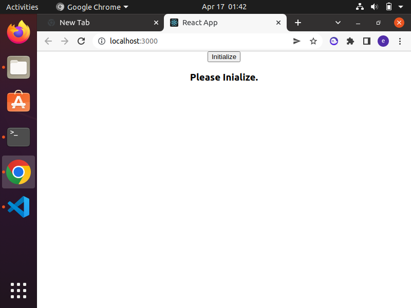
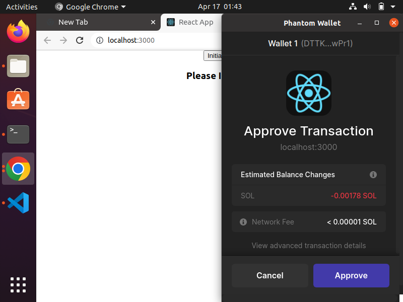
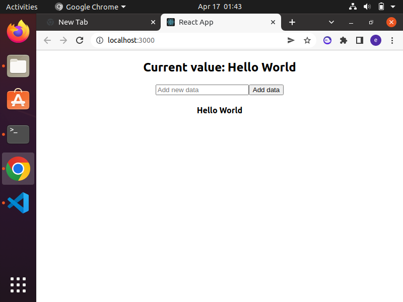

## Solana-development-Test-2

### Installation

1. Install the dependencies
```bash
npm i
```
Note: If you get error with npm i then use "npm i --legacy-peer-deps"

2. Start a local Solana node
```bash
solana-test-validator
```
3. Open new terminal and Build the anchor project
```bash
anchor build
```
4. Fetch the project ID for the build:
```bash
solana address -k target/deploy/<programname>-keypair.json
```
5. Update the project ID in the Rust program located at projectname/programs/src/programname.rs with the output from above.
6. Run the tests
```bash
anchor test
```
Note: If you get error then stop the solana-test-validator and run the tests
7. Change into the app directory and install the dependencies:
```bash
cd app && npm i
```
Note: If you get error with npm i then use "npm i --legacy-peer-deps"
8. Run the client-side app
```bash
npm start
```

## Output

### Client 
 <br/>

### Wallet
 <br/>

### Initialising and adding data
 <br/>
 <br/>
 <br/>
